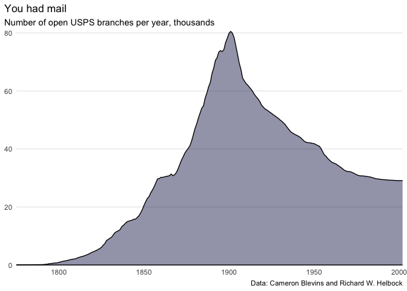

USPS branch data analysis
================
Patrick Scott
April 12, 2021

In this initial section we’re loading in the data.

``` r
## load tidyverse
library(tidyverse)

## read data from TidyTuesday GitHub
post_offices <- readr::read_csv('https://raw.githubusercontent.com/rfordatascience/tidytuesday/master/data/2021/2021-04-13/post_offices.csv')
```

With the data loaded in, I now want to loop through it to work out how
many post office branches were open in a given year.

``` r
open <- numeric(0)

for (i in (1775:2002)) {
  test <- post_offices %>%
    filter(established <= i) %>%
    filter(discontinued >= i | is.na(discontinued)) %>%
    nrow()

  open <- append(open, test)
}

## Create a tibble with the result of the loop
openByYear <- tibble(year = 1775:2002, open = open)
head(openByYear)
```

    ## # A tibble: 6 x 2
    ##    year  open
    ##   <int> <dbl>
    ## 1  1775    49
    ## 2  1776    73
    ## 3  1777    79
    ## 4  1778    79
    ## 5  1779    81
    ## 6  1780    81

Now we have our data we want to plot it with `ggplot2`

``` r
openByYear %>%
  ggplot(aes(year, open/1000), group = 1, color = "#333466") +
  geom_area(alpha = 0.5, fill = "#333466") +
  geom_line() +
  geom_hline(yintercept = 0) +
  theme_minimal() +
  theme(panel.grid.major.x = element_blank(),
        panel.grid.minor = element_blank(),
        axis.title = element_blank(),
        plot.title.position = "plot") +
  coord_cartesian(clip = "off", expand = F) +
  labs(title = "You had mail",
       subtitle = "Number of open USPS branches per year, thousands",
       caption = "Data: Cameron Blevins and Richard W. Helbock")
```

<!-- -->

``` r
## Save your plot if you want
## ggsave("2020-04-12-post-offices/usps.png", dpi = 144, width = 600/72, height = 338/72)
```
